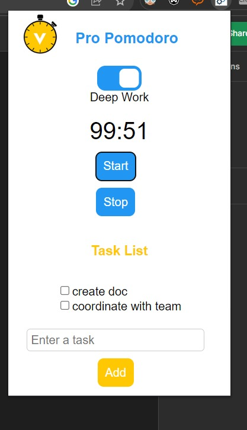

# Pro Pomodoro Chrome Extension

**Pro Pomodoro** is a Chrome extension that helps you manage your time effectively using the Pomodoro technique. It provides two working modes: normal mode (25-minute work and 5-minute break) and deep work mode (100-minute work and 20-minute break). The extension also allows you to set and complete your top tasks during the work sessions.

## Features

- Two working modes: normal mode and deep work mode.
- Start and stop timer buttons for each mode.
- Toggle switch to enable deep work mode for extended work sessions.
- Enter and complete top three tasks during work sessions.
- Visual and audio notifications for session changes.
- User-friendly popup interface.

## Author

**Akshay Kumar Gautam**

## How to Use

1. Load it as an unpacked extension.
2. Click on the extension icon in your Chrome toolbar to open the popup.
3. Choose the working mode and click the "Start" button to begin the timer.
4. Enter your top tasks in the input fields provided.
5. Complete tasks as you work and progress through your sessions.
6. The timer will alert you with notifications and audio cues for session changes.

## Screenshots

## Permissions

- Notifications: Required for displaying session change notifications.
- Storage: Required for storing user's completed tasks and preferences.

## Contributing

Contributions to this project are welcome! Feel free to submit issues and pull requests.

## License

This project is licensed under the [MIT License](LICENSE).
